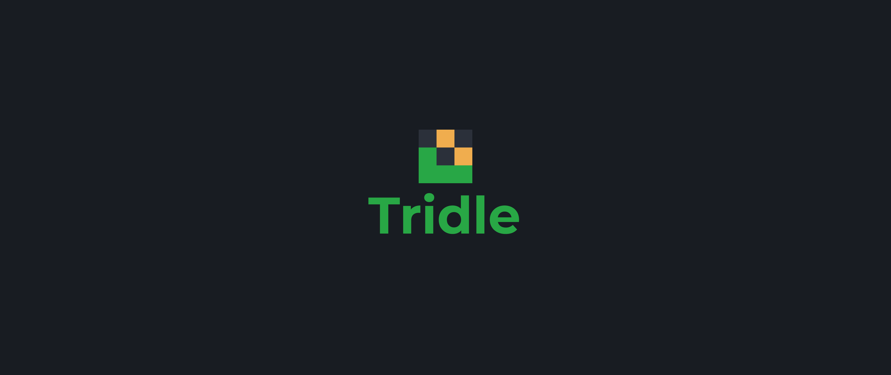

 
# About
[Wordle](https://www.nytimes.com/games/wordle/index.html), and Wordle knockoffs have taken up more of my time than I would like to admit. And I, being a typical web developer, wondered how difficult it would be to create a wordle clone. So one afternoon, instead of being productive I decided to make [Tridle](https://tridle.netlify.app/), a three letter wordle game. Feel free to check it out or submit any issues you may find with it :)
